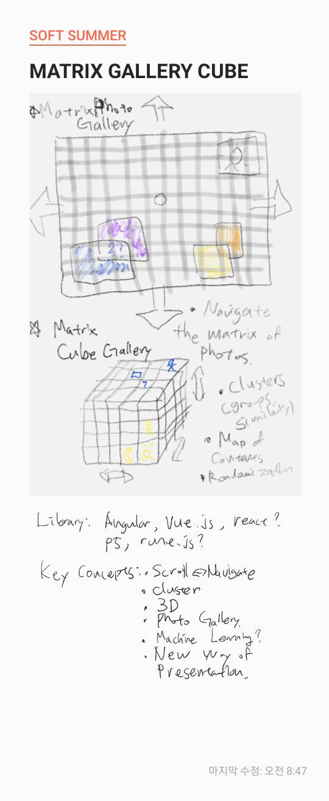

# Matrix_Gallery
An interactive, navigable, 3D Matrix Photo Gallery

Author : Seungin Lyu

Project Description :  
This is a side project for Fun Day Friday event in for "Olin Library Workshop : Software of Summer". It's a single-page "Web App" that conatins the following features.

* Key Features:
  * Navigable Matrix of Photos (3D Cube)
  * A Photo Gallery, A New Interactive Enironment
  * Quick Interface for Uploading/Downloading Images
  * Randomized Image Processing
  * Cluster of Photos based on Shared Trends
  * A Sense of Exploration & Randomization

* Dependencies
  * Client side:
    * Vue.js (Frontend)
    * Rune.js (SVG)
  * Server side: tbd

* 
